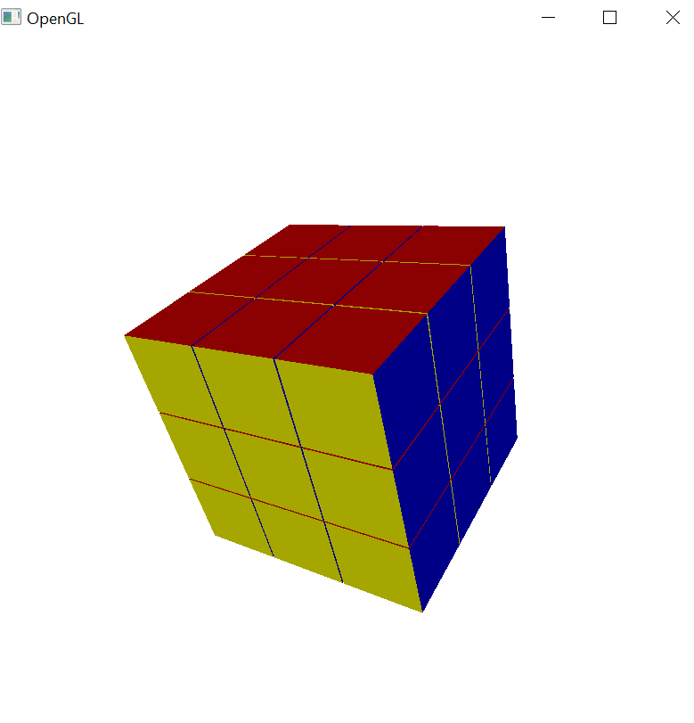
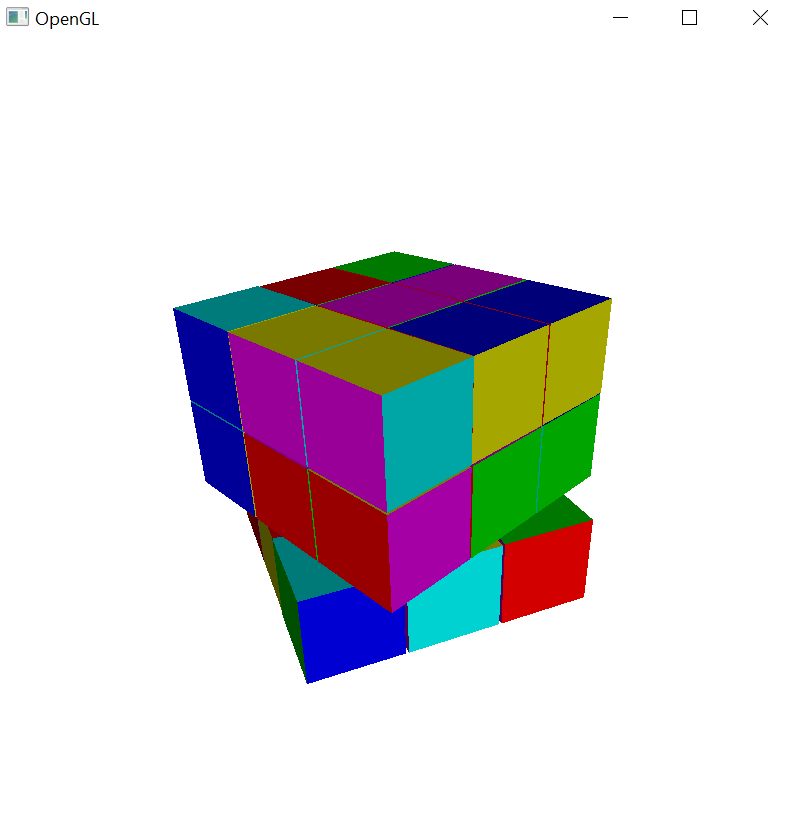

# Rubik-s-Cube
A 3D model of a Rubik's Cube - An assignment I made for a Computer Graphics elective course.
A practice mostly on transformation matrices, using C++ with OpenGL and GLSL (GL Shading Language)
    
Press:

'R' - for right wall rotation.

'L' - for left wall rotation.

'U' - for up wall rotation.

'D' - for down wall rotation.

'B' - for back wall rotation.

'F' - for front wall rotation.

Space - for flipping rotation direction (from clockwise to counter clockwise or vice versa).

'Z' - dividing rotation angle by 2 (until minimum of 22.5 degrees).

'A' - multiply rotation angle by 2 (until maximum of 180 degrees).

